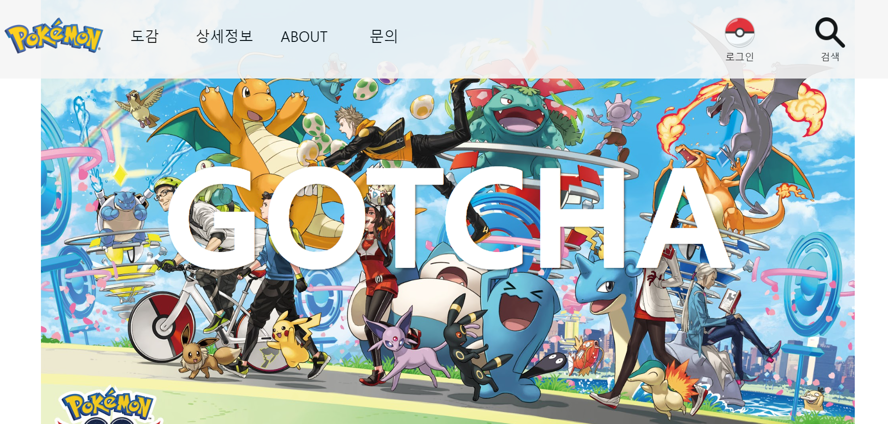
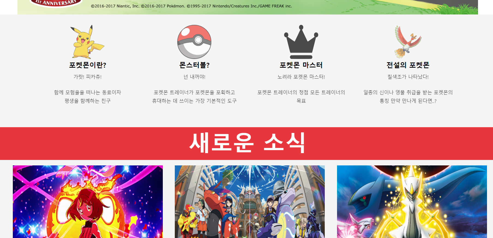
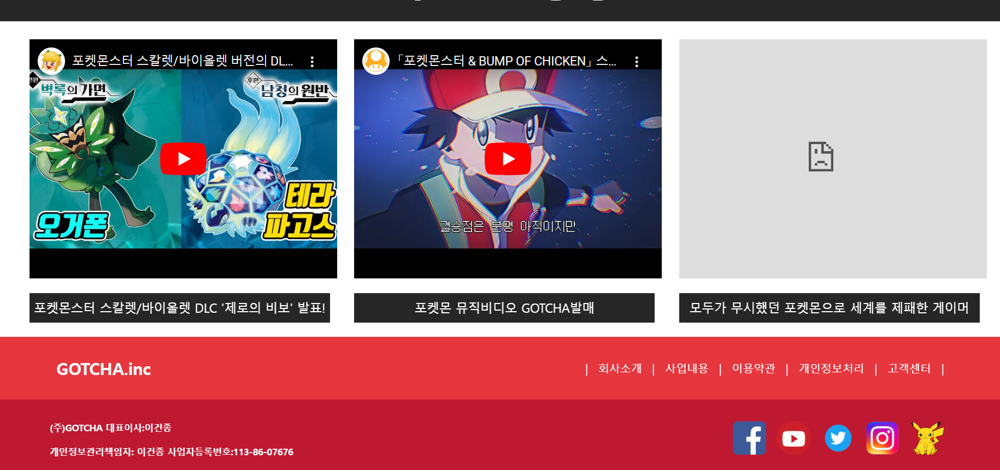
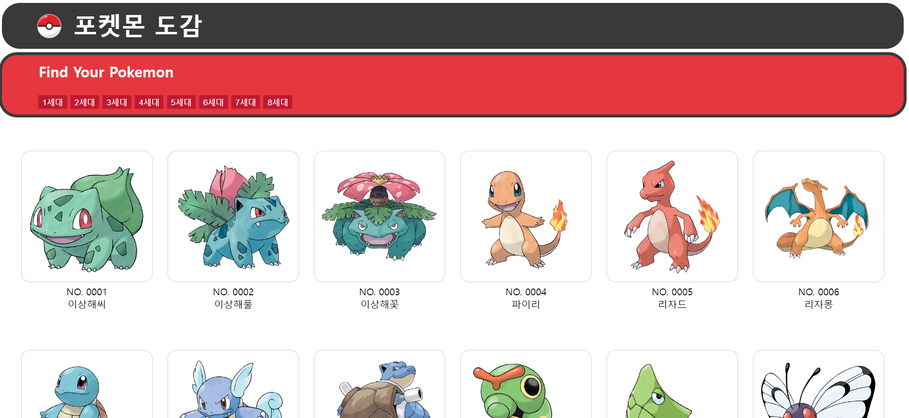
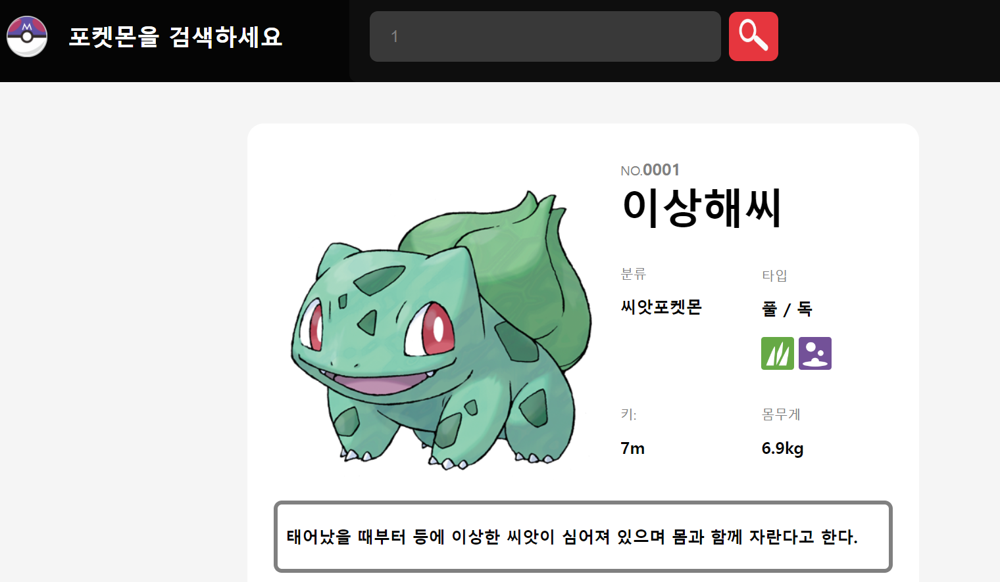
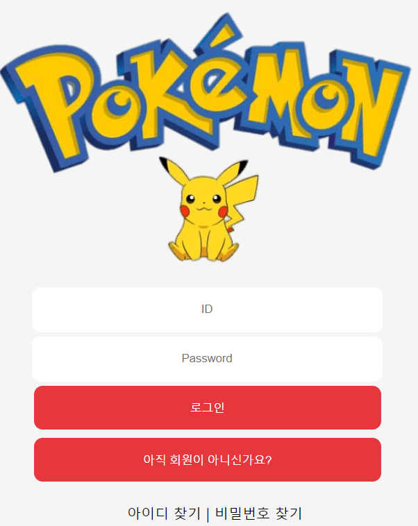

# **포켓몬 웹 디자인**

## **개요**
- HTML, CSS, JAVASCIPT, API등을 활용하여 간단한 웹사이트 디자인

## **개발 환경 및 활용 기술**
HTML, CSS, JAVASCRIPT

## **프로젝트 설명**

### **공정 구현에 사용된 입출력 장치**

### **메인페이지**

### **도감**

### **상세검색**

### **로그인**

